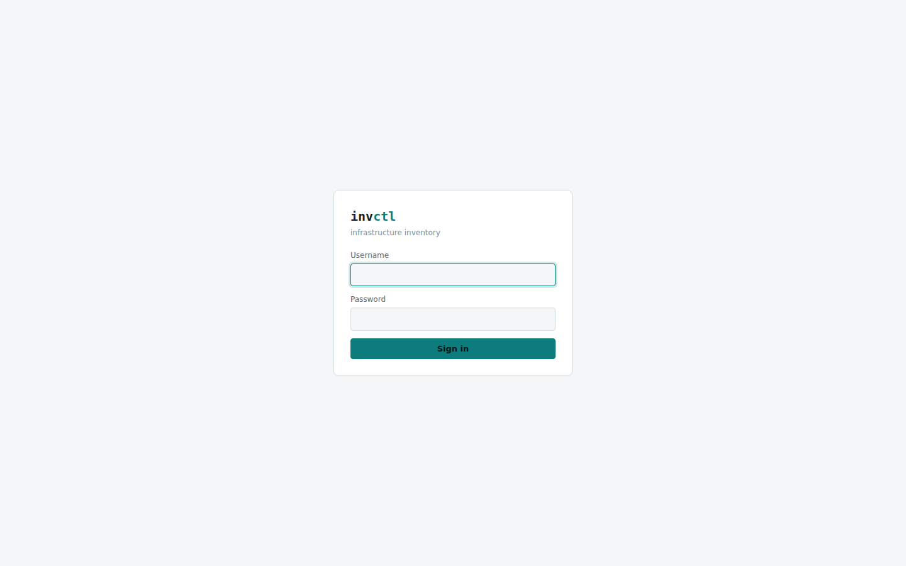
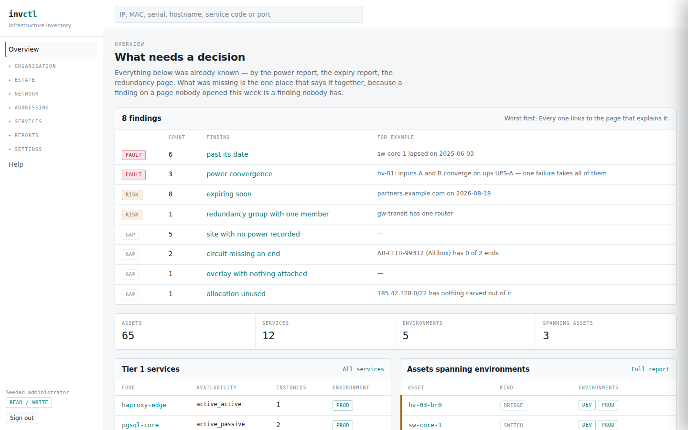
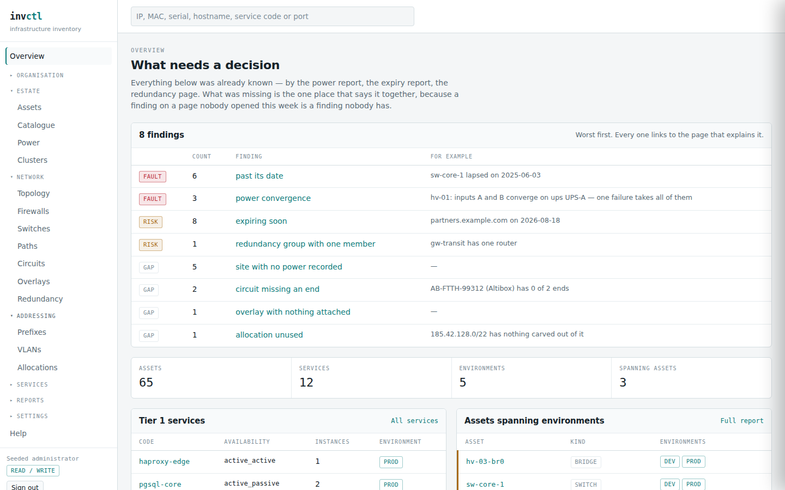

# Getting started

> Covers: `/login`, `/`
> Regenerated when: authentication, the navigation rail, the overview page or
> the findings summary changes.

invctl is an inventory of infrastructure that exists to answer one question
well: **when something fails, what else stops working?** It records what you
declare — assets, networks, dependencies, contracts — and reasons about the
consequences. It never changes anything on your estate.

## Signing in

Two kinds of account exist. A **local** account has a password stored as an
argon2id hash. An **LDAP** account is checked against your directory on each
sign-in and has no password here at all.

Whether you can change anything is decided by one list: usernames in
`INV_ADMIN_USERS` may write, and everyone else has read-only access to the same
pages. The rail's footer shows which you have.

## The overview

The first page is not a dashboard of counts. It is a list of **what needs a
decision**.

Every row here was already computed by some other page. What this adds is the
one place that says them together, because a finding on a page nobody opened
this week is a finding nobody has.

The three severities are not decoration:

| | |
|---|---|
| **fault** | something is wrong now — a certificate has expired, two supposedly redundant power feeds trace to one UPS |
| **risk** | nothing is wrong, and one failure away something is — a VRRP group with one router, a contract renewing next month |
| **gap** | the inventory does not know — a site with no power recorded, a circuit with one end |

The third is the one most tools leave out, and it is what makes the other two
worth trusting. Three faults across four modelled assets is not a healthy
estate; it is an unmodelled one, and a report that cannot say *"I do not know"*
is a report that guesses.

Every finding links to the page that explains it. Nothing here is stored — it is
recomputed on each visit, so it cannot go stale against the pages it summarises.

## Finding your way around

The rail groups pages by the question they answer rather than by what they
store. Groups are collapsed until you open them, and the group holding your
current page opens itself.

**Only what you open or close is remembered**, so the rail settles into the
shape you use. A group that opens because you happen to be on a page inside it
opens for that page and no longer than that — otherwise every section you ever
visited would still be expanded a week later, and the rail you arranged would
slowly stop being yours.

Two entries under **Network** — Firewalls and Switches — are the asset list with
a filter already applied. They are a view, not a second home: a firewall lives
in the Estate because it also sits in a rack, costs money, draws power and has a
support date. One place it lives, several places it appears.

Using one of them puts you in **Network**, not in the Estate, because that is
the entry you clicked. The rail marks the view you are in rather than the page
underneath it.

The search box at the top takes an IP address, a MAC, a serial, a hostname, a
service code or a port number, and resolves it to whatever holds it. It is the
fastest route into the software when you arrive with only an address from an
alert.

## What this software will not do

invctl **presents** state. It does not push configuration, restart anything,
open a firewall rule or reach out to your estate at all. Where it shows health
reported by a monitoring system, it labels it as observed, names the reporter
and shows its age — because showing is not acting.

That boundary is enforced in the code, not merely intended: a test refuses any
outbound network capability in the codebase, with one allowed exception for the
LDAP bind that authentication needs.
