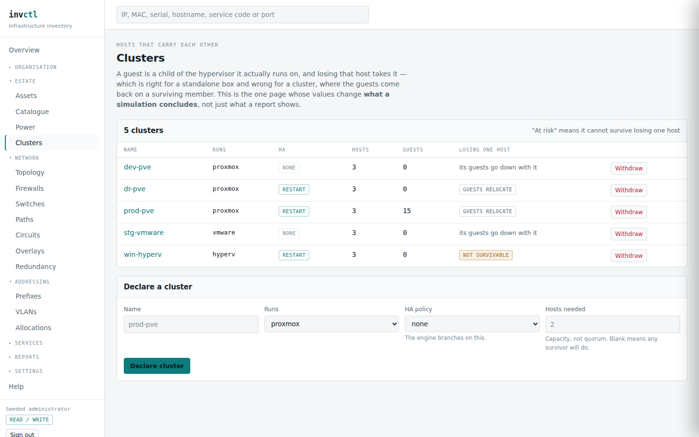

# The estate — assets, catalogue, power, clusters

> Covers: `/assets`, `/assets/{id}`, `/catalogue`, `/power`, `/clusters`, `/clusters/{id}`
> Regenerated when: the asset model, the hardware catalogue, the power chain or
> the cluster model changes.

Everything physical, and the things that decide what losing it costs.

## Assets

An asset is anything you would point at: a site, a rack, a PDU, a switch, a
hypervisor, a virtual machine, a bridge. They nest — a VM inside a hypervisor
inside a rack inside a site — and that containment is what makes *"this rack
loses power"* and *"reboot this VM"* the same kind of question.

Two rules are worth knowing before you type anything:

**Nothing is ever deleted.** An asset you retire keeps its row, its history and
its audit trail; it leaves every list and every calculation. This is why a name
freed by retiring something becomes available again — uniqueness is a statement
about what exists, and a retired asset does not.

**A name is unique among its live siblings**, not globally. Two racks called
`R1` in different sites is normal, and so is `web-01` in two clusters. This is
also the key a spreadsheet import can express, since a file does not know your
UUIDs.

## The catalogue

A device type is a model you own several of — `PowerEdge R660`, `AP8853` — with
the manufacturer's published end-of-support date on it.

The point is inheritance. An asset with no date of its own **inherits** its
model's, so cataloguing one switch dates every switch of that model. An asset
*with* a date **overrides** it, and the direction is deliberate: it is not
"whichever is later". A private support contract can carry one box years past
what its model promises, and a second-hand unit can fall short — so the more
specific assertion wins over the more general fact.

Because a resolved date is only half the answer, every view that shows one also
shows **where it came from**: recorded on this asset, or inherited from a named
model. A report that renders those identically has merged a fact with an
assumption.

## Clusters

This is the one page whose values change **what a simulation concludes**, not
just what a report shows.

A guest is a child of the hypervisor it actually runs on, and losing that host
takes it. Correct for a standalone box; wrong for a cluster, where the guests
restart on a surviving member. Declaring the cluster is what tells the engine
which of those is true.

Two fields decide it:

**HA policy.** `none` means guests go down with their host — what the engine
assumes for any hypervisor not in a cluster. `restart` means they come back
elsewhere, after a restart during which they were not serving.

**Hosts needed** is capacity, not quorum: how many members must survive for the
guests to fit. Leave it blank and any single survivor is assumed to do, which is
optimistic — and optimistic on purpose, because it is what an operator believes
before checking, and therefore the belief worth testing against reality.

The last column does the arithmetic for you. In the screenshot, `win-hyperv` has
three hosts, needs three, and reads **not survivable**: HA is configured and
cannot help. That cluster looks identical to a healthy one on every other page
in the software, which is exactly why the column exists.

A host belongs to at most one cluster — two would make "where do its guests go"
ambiguous — and the membership is replaced wholesale when you save it, with the
change recorded against the cluster.

## Power

The power chain runs upwards: an asset draws from a feed, a feed comes off a
board, a board is fed by a supply, and supplies nest — a UPS behind a generator.

The findings this produces are on the [power report](50-reports.md), but the
distinction worth learning here is between **a fault and the design**. Two feeds
converging on one UPS is false redundancy: the rack believes it has two
independent supplies and one failure takes both. Two UPS groups converging on
one generator is not a fault at all — it is what makes a utility failure
survivable, and reporting it as a problem would teach you to ignore the page.

Ratings are nullable throughout, and blank means *not recorded* rather than
zero. An unrated feed is counted as unrated and never reported as
over-allocated.
