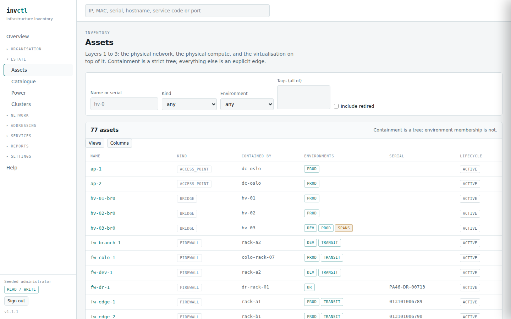

# The estate — assets, catalogue, power, clusters

> Covers: `/assets`, `/assets/{id}`, `/catalogue`, `/power`, `/clusters`, `/clusters/{id}`
> Regenerated when: the asset model, the hardware catalogue, the power chain or
> the cluster model changes. Capacity, cost and shared tenancy are covered in
> **Money**, which owns those panels.

Everything physical, and the things that decide what losing it costs.

## Assets

An asset is anything you would point at: a site, a rack, a PDU, a switch, a
hypervisor, a virtual machine, a bridge. They nest — a VM inside a hypervisor
inside a rack inside a site — and that containment is what makes *"this rack
loses power"* and *"reboot this VM"* the same kind of question.

The **contained by** column is the tree; nothing else on the row is. Environment
membership in particular is a set rather than a place, and an asset in more than
one carries a `SPANS` tag — a bridge on both the development and production
networks is either deliberate or the most interesting thing on the page.

`Include retired` is off by default, which is why the count here is smaller than
the number of rows the database holds.

Two rules are worth knowing before you type anything:

**Nothing is ever deleted.** An asset you retire keeps its row, its history and
its audit trail; it leaves every list and every calculation. This is why a name
freed by retiring something becomes available again — uniqueness is a statement
about what exists, and a retired asset does not.

**A name is unique among its live siblings**, not globally. Two racks called
`R1` in different sites is normal, and so is `web-01` in two clusters. This is
also the key a spreadsheet import can express, since a file does not know your
UUIDs.

## Taking a list away with you

Under the table is **Download this list as CSV**. It exports what you are
looking at, filters included — filter to firewalls and you get the eight
firewalls, not all seventy-two.

The columns are **the ones the importer reads**, so a file you export can be
edited in a spreadsheet and loaded back. That round trip is the point: bulk
correction is the job people actually have, and an export whose shape the
importer rejects makes them retype it.

Four lists export: assets, services, circuits and prefixes. A feature present on
one page and missing on three is a feature nobody discovers, so the four behave
identically and a test enforces it.

## The catalogue

A device type is a model you own several of — `PowerEdge R660`, `AP8853` — with
the manufacturer's published end-of-support date on it.

The point is inheritance. An asset with no date of its own **inherits** its
model's, so cataloguing one switch dates every switch of that model. An asset
*with* a date **overrides** it, and the direction is deliberate: it is not
"whichever is later". A private support contract can carry one box years past
what its model promises, and a second-hand unit can fall short — so the more
specific assertion wins over the more general fact.

Because a resolved date is only half the answer, every view that shows one also
shows **where it came from**: recorded on this asset, or inherited from a named
model. A report that renders those identically has merged a fact with an
assumption.

The asset page is where that shows plainly. `hv-win-01` has no date of its own,
so the page names the model it took one from — and had somebody typed a date
here, the same line would say so instead.

Three panels below it answer three different questions, and the difference
between them is the difference between an inventory and an impact report.
**Contains** is what falls with it. **Workloads** is what an outage actually
takes away, which is not the same thing — an empty hypervisor loses nothing but
itself. **Observed health** is the only part of the page the estate wrote rather
than a person: it carries its reporter and its age, and once a reading is older
than three of that reporter's intervals it shows as `unknown` rather than as a
last value that has stopped being true.

A rack's page carries two more panels — its elevation and its
[physical fit](25-racks.md) — because a cabinet is asked different questions
from the things inside it.

## Notes

What a person knows that no column has a place for: why it is on that firmware,
which case covers it, what was decided and by whom.

Four kinds, because a reader scanning a timeline wants to tell them apart:
**note** for context, **incident** for what happened while it was happening,
**maintenance** for planned work, and **decision** for a choice and its reason —
the one that rots worst untold.

Notes appear on the **timeline** beside the audit trail and are labelled there
as notes, so what somebody wrote and what the software recorded never look like
the same kind of statement. They sit on ten kinds of thing: assets, services,
circuits, clusters, projects, overlays, redundancy groups, VLANs, prefixes and
teams.

A withdrawn note keeps its row like everything else here. Something that was
said was still said, and the record of the withdrawal has to refer to something.

**One warning, and it is not the only place in the software that needs it.**
The audit trail deliberately holds no personal data — it records an opaque
account id, never a name — which is what lets it be kept for ever with no
retention argument. A note is free text and is kept on those terms: written
down, permanent, and readable by anyone who can see the timeline. Do not
write anything here about a person that you would not want kept indefinitely.

An estate's own custom fields (defined by an administrator, values recorded
per asset or service) carry a related warning for a different reason. A
change to a custom value is audited like everything else, but the audit
trail records only that the value changed and which field — a keyed digest,
never the text itself — so a value does not accumulate in the log the way a
note does. It still lives on the entity's own page, unencrypted, for as long
as anybody keeps it there, so the same caution applies to what you type: the
software warns about it at both places you can type one, defining the field
and filling in a value.

## Clusters

This is the one page whose values change **what a simulation concludes**, not
just what a report shows.

A guest is a child of the hypervisor it actually runs on, and losing that host
takes it. Correct for a standalone box; wrong for a cluster, where the guests
restart on a surviving member. Declaring the cluster is what tells the engine
which of those is true.

Two fields decide it:

**HA policy.** `none` means guests go down with their host — what the engine
assumes for any hypervisor not in a cluster. `restart` means they come back
elsewhere, after a restart during which they were not serving.

**Hosts needed** is capacity, not quorum: how many members must survive for the
guests to fit. Leave it blank and any single survivor is assumed to do, which is
optimistic — and optimistic on purpose, because it is what an operator believes
before checking, and therefore the belief worth testing against reality.

The last column does the arithmetic for you, and the demo shows all three
answers side by side. `dev-hetzner` has two hosts and no floor, so its guests
**relocate**. `stg-vmware` has no HA at all, so its guests **go down with it** —
the honest answer, not a failure. And `win-hyperv` has three hosts, needs three,
and reads **not survivable**: HA is configured and cannot help.

That last one is the case worth understanding, because it looks identical to a
healthy cluster on every other page in the software. The detail page says it in
full:

A host belongs to at most one cluster — two would make "where do its guests go"
ambiguous — and the membership is replaced wholesale when you save it, with the
change recorded against the cluster.

**Retiring every host does not retire the cluster.** It keeps its row and shows
with no members, as `dev-pve` does in the screenshot. That is deliberate rather
than an oversight: the cluster is something a person declared, and only a person
withdraws it. An empty one is worth seeing — it is either a migration nobody
finished tidying up or a name about to be reused.

### How big it is, and who is standing on it

The same form carries two more declarations, and both are judgements rather than
readings: a **CPU overcommit ratio** — written as it is spoken, `3` or `1.5` —
and a **cost split**, the proportion of the cluster's cost attributable to CPU
rather than memory.

Below the membership, the page then answers three questions the estate could not
answer before: what this cluster can carry, who holds what share of it, and what
that share costs. Those panels have their own section — see **Money** — because
the arithmetic behind them is worth reading once rather than explaining twice.

One thing belongs here rather than there. **The capacity figures say what they
could not see.** A cluster with three hosts of which one has no recorded size
does not report the capacity of two; it reports a floor, and says so. An estate
that has measured nothing must be able to say it knows nothing, or every figure
built on it is a guess with a decimal point.

## Power

The power chain runs upwards: an asset draws from a feed, a feed comes off a
board, a board is fed by a supply, and supplies nest — a UPS behind a generator.

The findings this produces are on the [power report](50-reports.md), but the
distinction worth learning here is between **a fault and the design**. Two feeds
converging on one UPS is false redundancy: the rack believes it has two
independent supplies and one failure takes both. Two UPS groups converging on
one generator is not a fault at all — it is what makes a utility failure
survivable, and reporting it as a problem would teach you to ignore the page.

Ratings are nullable throughout, and blank means *not recorded* rather than
zero. An unrated feed is counted as unrated and never reported as
over-allocated.
