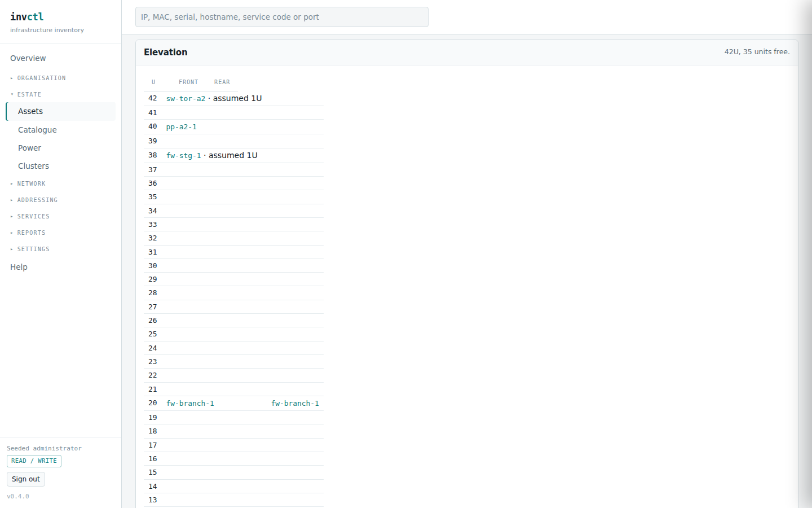
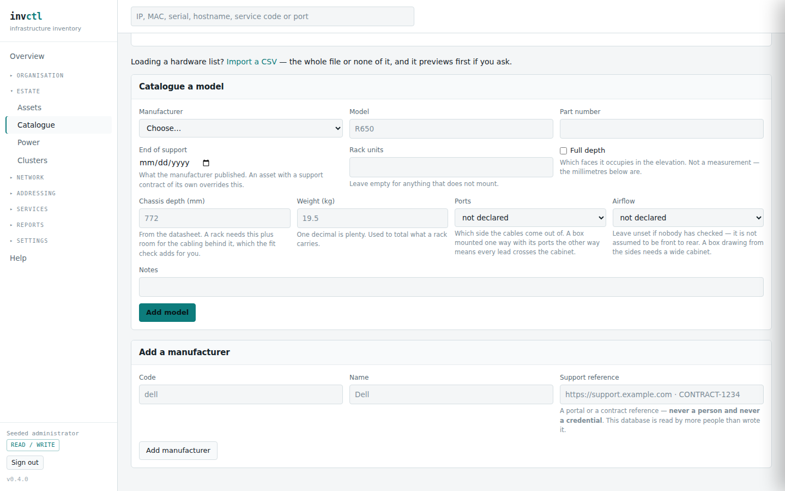

# Racks — will it fit, will it hold, will it stay cool

> Covers: `/assets/{id}` for a rack, `/catalogue`
> Regenerated when: the physical fit rules, the rack elevation or the hardware
> catalogue's measurements change.

The questions people argue about standing in front of a cabinet, answered from
what somebody wrote down.

**Nothing on this page refuses a placement.** A 772mm server is in a 600mm
cabinet, the rear door does not close, and somebody did it anyway. Refusing that
record would not stop it happening — it would stop it being *recorded*, and the
operator would either lie to the form or leave the box out. So none of this is
validation. It is findings, and findings are for reading.

## The elevation

Units count from the floor. A box marked **full depth** occupies both faces and
shows in both columns; anything else occupies the face it is mounted on.

Two honest signals are worth knowing:

**`assumed 1U`** means nobody catalogued a height, so the elevation drew one
unit to have somewhere to put it. It is a guess and says so.

**Assets with no position** are listed underneath the table rather than hidden.
A box in a rack whose unit nobody recorded is still in the rack, and dropping it
from the picture would make the cabinet look emptier than it is.

## Physical fit

Four checks run over whatever has been measured — depth, load, airflow and
cabling. Each reports a **fault** when the numbers prove a problem, a **risk**
when they prove one is likely, and a **gap** when the measurement is missing.
Missing never reports as a pass.

The findings also appear on the [overview](00-getting-started.md), grouped with
everything else that needs a decision, so a cabinet nobody opened this month
still reaches somebody.

### Depth

A box needs its chassis **plus 75mm behind it**. Power cords leave the back and a
C13 lead has a bend radius, so a bare *depth ≤ cabinet* comparison passes a
772mm server into an 800mm cabinet that it does not fit. The finding prints the
arithmetic so you can disagree with it.

The rack's **usable depth is measured, not derived**: rail face to the rear door.
Where the rails sit is an installation choice, so no datasheet can tell you.

### Load

The panel says **"at least"** and names how many boxes are unweighed. Summing
what is known and printing a total would silently assume the uncatalogued boxes
weigh nothing — and it would be wrong in the dangerous direction, under-reporting
a rack somebody is about to add to.

### Airflow

Two findings, and the obvious one is not among them.

**A side-breather in a narrow cabinet.** A box drawing air from its flanks does
not care what sits above and below it; it cares what is beside it, and that is
decided by the cabinet's **width**. A 600mm cabinet leaves about 58mm a side for
both the cable channel and the intake, and the same box in an 800mm one has
room. Position in the rack is not the question — "in the middle of a rack" fires
on every full cabinet and stays quiet on the one that matters.

**Neighbours breathing against each other.** Here position does decide it: a box
blowing rear-to-front directly above one blowing front-to-rear is being fed the
other's exhaust. Only boxes actually touching, or with a single free unit
between them, are compared — a wider gap is a much weaker thermal argument and
reporting it is the noise that gets a page ignored.

Neither finding claims the intake is blocked. Cable routing is not modelled, so
"48 leads terminate here, therefore it cannot breathe" would be a confident
claim about something nobody recorded. It names the risk and sends a person to
look.

### Cabling

**Leads that cross the cabinet.** A lead between two boxes whose ports face
opposite ways leaves the front of one, travels round the cabinet and arrives at
the back of the other. Note what is *not* reported: a server mounted at the front
with its ports at the rear is every server ever built, and a check that fires on
the normal case is one people switch off. What is compared is the two ends of an
actual cable.

**A box carrying a lot of cable in a cabinet with nowhere to put it** — 24 leads
or more, which is one side of a 48-port switch, in a cabinet under 700mm wide.

**A cable that cannot reach.** A lead does not travel diagonally: it leaves the
port, runs to the vertical channel, drops, comes back out, and wants a service
loop so the box can be slid forward without unplugging it. The check allows
500mm for all of that on top of the vertical drop, and is deliberately generous —
it exists to catch a lead that cannot possibly reach, not to second-guess your
cable management. The usual cause is somebody recording the length of the patch
lead in their hand rather than the one that was fitted.

Cable checks are **same-cabinet only**, and that is a limit rather than an
omission: invctl holds no floor plan, so the distance between two racks is
unknown, and guessing it would invent the one number the answer turns on.

## Where the measurements go

Nothing above works without somebody typing the numbers, and they live in two
different places because they answer two different questions.

**The cabinet states its own capacity.** Editing an asset of kind *rack* asks
for rack units, usable depth, width and load rating — and asks nothing about
where it sits. Everything that is not a rack is asked the opposite: its position
and its face.

**The model states what a box is.** Depth, weight, port face and airflow belong
to the catalogued model, not to the individual box, so measuring one PowerEdge
R660 measures every one you own.

**Blank is never a pass.** An undeclared airflow does not default to front-to-
rear and an undeclared port face does not default to front, even though both are
the common answer. Defaulting would let every uncatalogued box clear every check
in silence, and an estate that had declared nothing would report perfect
cooling. Unknown reports as a gap, and a gap is a thing to go and do.

Two values are worth declaring rather than leaving blank because they *are* an
answer: **moves no air**, for a patch panel or a blanking plate, and **front and
rear** ports, for a panel or a chassis switch that presents both. Both are
assertions somebody made, and both stop a box being counted as an open question.
