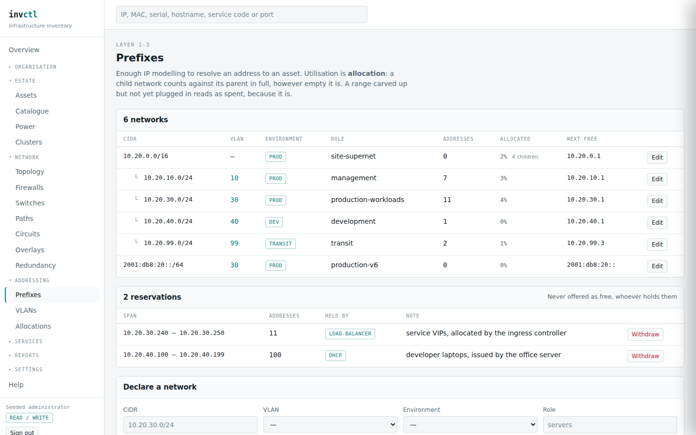

# Addressing — prefixes, VLANs, allocations

> Covers: `/prefixes`, `/vlans`, `/vlans/{id}`, `/allocations`
> Regenerated when: the prefix tree, IP ranges, the VLAN model or the registry
> layer changes.

Where addresses come from, what is spent, and what is left.

## Prefixes

Networks are shown as a tree. Containment is computed from the addresses
themselves, so declaring a narrower network re-parents everything under it
without anybody editing a link.

**Utilisation means allocated, not occupied**, and this is the number people
misread. A child network counts against its parent **in full**, however empty it
is. Carving a /26 out of a /24 spends that space whether or not anything is
plugged in yet, because the question you actually ask is *"what can I still
carve out of here?"*

The consequence looks like a bug the first time: a parent can read **100%** while
every child inside it reads **0%**. That is correct. The space is gone; nobody
has plugged anything in. Counting only assigned addresses instead would report a
fully subnetted /24 as almost empty, which is how a range gets handed out twice.

**Next free** is the lowest address nothing has taken, and "taken" is broader
than it looks. It skips assigned addresses, the network and broadcast addresses
of an IPv4 network, **any child network** — that space is delegated, not yours
to hand out one at a time — and **any reservation**. A /31 is treated properly:
both its addresses are usable, because that is what point-to-point links do.

## Reservations

A reservation is a span set aside for something that is not this system: a DHCP
pool, a load balancer's VIP range, a band somebody reserved by hand. Two
addresses, not a CIDR, because reservations are rarely mask-aligned — *"the top
half of the /24 is DHCP's"* is `.128` to `.254`.

A reserved span is never offered as free, whether or not anything in it is
recorded here. That is the entire point: whatever holds it will issue from it
without asking.

## VLANs

A VLAN is a broadcast domain, not a number written on a network. Two ports in
the same VLAN can reach each other whether or not a cable was drawn between
them, which is a fact no cable trace produces.

**A VLAN ID is only unique somewhere.** 4094 exist and every site reuses them —
VLAN 10 in one building and VLAN 10 in another are different domains that have
never met. A VLAN therefore belongs to a *group*, and the group says where the
numbering applies. The group is scoped to an asset: a site, a rack, a cluster.
Leave it blank and the numbering is estate-wide.

A VLAN's detail page leads with its **ports**, and says so when there are none —
a VLAN with networks and no ports is a declared record rather than a broadcast
domain, and nothing can reach anything through it.

More than one network on one VLAN is normal and usually dual-stack: the IPv4 and
IPv6 halves of a broadcast domain are one place. A bare VLAN number written on
each network could never say that.

A port has at most **one untagged VLAN** — a frame arriving without a tag must
have one unambiguous home — and choosing a new one replaces whatever was there
rather than refusing.

## Allocations

A prefix says a network exists. An allocation says whether the space is
**yours**: a registry delegation you keep, a slice of a provider's range that
leaves with the contract, or RFC1918 that was never anybody's to give. Three
different answers to *"can we renumber out of this?"*

An allocation is deliberately not a prefix. A prefix is something you route and
address hosts from; an allocation is registry paperwork, and treating it as a
prefix would put paperwork into the tree the allocator walks and offer somebody
the first address of a /22 nobody has subnetted.

Only the *shallowest* networks inside an allocation count towards its
utilisation — a network nested inside another is already covered by its parent,
and counting both is how a delegation reports more than 100% used.

An untouched private range is untidy. An untouched registry allocation is money,
and only the second is flagged.
