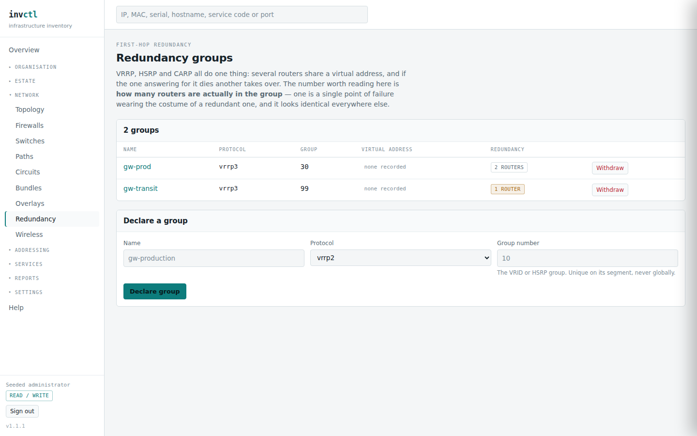
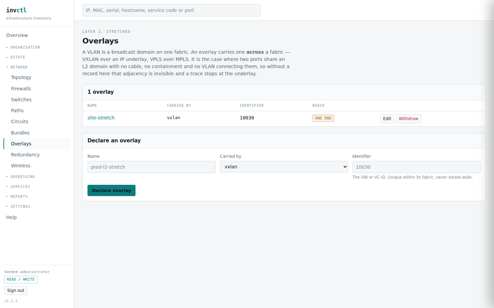

# Network — topology, circuits, overlays, redundancy

> Covers: `/network`, `/paths`, `/circuits`, `/circuits/{id}`, `/circuits/{id}/impact`, `/overlays`, `/redundancy`, `/redundancy/{id}`
> Regenerated when: circuits, first-hop redundancy, overlays or the reachability
> model changes.

How things connect, who sells the connection, and what survives losing one.

## Topology and paths

**Topology** records forwarder groups — an MCLAG pair, an HA firewall pair, a
standalone switch — what attaches to them, and which groups uplink to which.
That graph is what the impact engine walks to decide whether losing a switch
isolates anything.

**Paths** traces a cable run end to end, through patch panels, and reports where
it stops. A trace has a hop limit and a loop guard: a mis-patched panel that
loops back on itself is reported as a loop rather than followed for ever.

## Redundancy groups

VRRP, HSRP and CARP all do one thing: several routers share a virtual address,
and if the one answering dies another takes over.

The number worth reading is **how many routers are actually in the group**. One
is a single point of failure wearing the costume of a redundant one — the
protocol is configured and buys nothing — and it looks identical to a healthy
group everywhere else in the software. The detail page states it in a warning
rather than leaving you to compare a count.

The virtual address is a real address record, not text on the group. That is
what stops the allocator ever offering a live gateway address to somebody else.
Assigning one also clears whatever port held it, because an address answered for
by a group does not live on one box.

## Circuits

The estate already records the *port* a handoff lands on. A circuit is the other
half: who sells it, what was committed, what it costs a month, and **when the
contract ends**.

Nothing stops working on that date. Somebody either renegotiates or is
auto-renewed at a rate nobody checked — the second being the cheaper failure to
catch early, which is why contract ends appear in the [expiry
report](50-reports.md) alongside hardware and certificates.

A circuit has an A end and a Z end, and each lands on **a site or a port, never
both**. One end recorded is half a fact: somebody knows where it arrives and not
where it comes from, and the list says so rather than looking complete.

Costs attach to a circuit exactly as they do to an asset, with the same validity
windows. A one-off install fee is spread to the **contract end**, because a
circuit has no end-of-support — it has a contract, and a fee spread over
anything else is a made-up number.

A circuit's monthly rate is also the thing most likely to be **repriced** at
renewal, so the page carries the same reprice action and price-movement panel an
asset has: the old figure is closed rather than overwritten, and the rise is
shown against inflation as well as in cash. See **Money** for how that reads.

**A circuit can belong to a project, and the link is made from the project's
page rather than this one** — the circuit page says nothing about it. Until the
link exists, the connectivity a project depends on costs it nothing on paper,
and every project leaning on a transit circuit reports less than it costs.
`owns` puts the rate in one project's total; `uses` is the ordinary relation
here, because one circuit commonly serves everything in a rack.

## If the fibre is cut

A circuit's page has **Simulate cutting this**. It is a different question from
losing an asset: nothing is taken out of the estate and the ports at both ends
are fine — what goes away is the *span* joining two places.

The page leads with whether the circuit is a **connectivity edge** at all, and
that is the first thing to read.

**"This circuit joins nothing that is modelled"** is the common answer, and it
is ordinary rather than wrong. A circuit only becomes an edge when both ends
land on a port, each port belongs to something that forwards, and those two
things are in different forwarder groups. Most circuits end at the provider, and
the provider's side is not modelled here. Its cost and its contract end are
still tracked and its terminations are still recorded — it simply cannot change
what is reachable, so there is nothing below. Three of the demo's four circuits
answer this way.

**"Cutting this separates the estate"** is the other, and the screenshot is it.
The dark fibre is the only path between the Oslo and Bergen forwarders, so
cutting it leaves the two sides unable to reach each other.

Then read what follows it, because this is the pairing that matters: the estate
is genuinely cut in two and **nothing breaks**. That is not a contradiction and
it is not a clean bill of health. Nothing currently recorded on the far side
depends on reaching this one — which, about a disaster-recovery site, usually
means the far side is not yet modelled rather than that it is safe. The page
says so itself rather than letting a quiet result be read as reassurance.

## Overlays

A VLAN is a broadcast domain on one fabric. An overlay carries one *across* a
fabric — VXLAN over an IP underlay, VPLS over MPLS. It matters because every
other way this software answers "what can reach what" comes from cables,
containment and VLAN membership, and an overlay is exactly the case where two
ports share a domain with none of those three connecting them.

A termination attaches **a VLAN or a port, never both**. A row naming both says
the overlay lands in two places at once; one naming neither attaches nowhere.
Both look like a connection and are not.

An overlay with one termination is reported: it is configured and connects
nothing to anything, which usually means the far side was never built or is
missing from the inventory.
