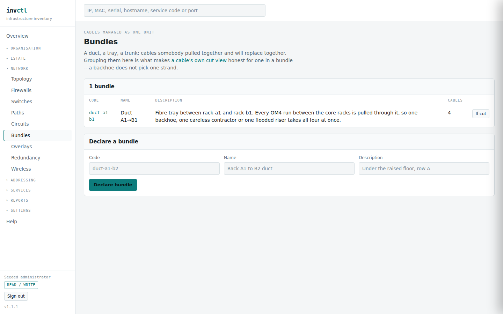

# Bundles, breakout cables and wireless

> Covers: `/bundles`, `/bundles/{id}/impact`, `/wireless`, the breakout form on
> an asset page
> Regenerated when: cable bundling, breakout cables or the wireless model
> changes.

Three things the cable list on its own gets wrong. Cables that share a fate
because they share a duct; one cable that is several cables at one end; and a
broadcast domain with no cable in it at all.

## Bundles

A bundle is **a duct, a tray or a trunk** — cables somebody pulled together and
will replace together.

Recording one exists for a single reason: **a cable's own cut view is wrong by
omission for a cable in a duct.** Ask "what happens if this fibre is cut" and
the honest answer for a strand in a tray is "the other three go too", because a
backhoe does not pick one strand. Without the bundle, the software answers for
one cable and is confidently incomplete.

Membership is replaced wholesale when you save it, and the change is recorded
against the bundle rather than against each cable — the bundle is what somebody
declared, so the bundle is what the audit names.

### What a cut actually does

Every **live** cable in the bundle is severed at once. A retired cable in the
same bundle is history rather than something still there to be cut, so it is
left out.

**"This bundle joins nothing that is modelled" is a real answer, not a
failure**, and it is the one most likely to be mistaken for a bug. All four
cables are genuine and all four are traced; none of them joins two *forwarding*
assets in two different network groups, so cutting them cannot split the estate
in two. The duct in the demo runs between two core racks whose switches are in
the same group, and carries second homes for hosts that still have their first.

That distinction matters because **joining nothing and cutting something
harmlessly look identical in a result** — both report no partition — and they
need opposite sentences. One means "there was nothing here to lose"; the other
means "there was, and it survived". The page says which.

Nothing is taken out of the estate by a simulation. Anything still reachable
another way is correctly reported as unaffected.

## Breakout cables

A QSFP-to-4×SFP+ DAC is **one cable with one end on one side and four on the
other**. Recorded as four unrelated cables, the estate loses the fact that one
connector failing takes all four; recorded as one cable, it loses three ports.

Declaring a breakout records it as **strands of one physical assembly**. The
near port is shared by every strand — that is the connector — and each far port
gets its own. Cutting any strand reports every strand as lost, because one
connector is one failure.

Two rules the form enforces rather than suggests:

- **At least two strands.** A one-strand breakout is an ordinary cable with two
  unused columns, not a smaller breakout.
- **Every strand agrees on medium and length.** They are one assembly; rows that
  disagree describe a cable that does not exist, so the software refuses the
  disagreement rather than storing it.

**There is no "add a strand later".** The factory fitted four; nobody adds a
fifth to a cable they are holding. If the record is wrong, withdraw it and
declare the real one — which is why the strands behave like ordinary cables for
correction and withdrawal.

Where a breakout is pulled through a duct, the bundle's cut page counts it as
**one cable with four strands** rather than four cables, so a backhoe is not
reported four times over.

## Wireless

An SSID is modelled as a **structure**, the same shape a VLAN or a first-hop
redundancy group already uses, which is what lets the impact engine pick it up
without knowing anything special about radio.

**An SSID broadcast by several access points is one broadcast domain**, whether
or not a cable joins the laptops on it. That is the claim the page exists to
record: take down every AP carrying `corp` and the SSID is *emptied*, which is
an outage no cable diagram shows.

**An SSID with no radios is a declared record and not yet on the air anywhere.**
That is a legitimate state — somebody has agreed the network will exist — and
saying so is better than rendering it as though it were broadcasting.

The `guest` SSID carries a VLAN and no authentication service; `corp` carries
an authentication service and no VLAN of its own. Both are normal, and the
columns are separate because they answer different questions: which broadcast
domain the traffic lands in, and what decides whether a client may join.
