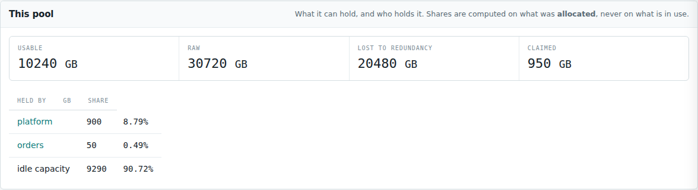

# Money — what it costs, and whose cost it is

> Covers: the cost panel on any asset, service, project or circuit;
> `/clusters/{id}`'s capacity, share and cost panels; a storage pool's page;
> the shared-tenancy panel on a workload.
> Regenerated when: the cost model, the capacity model, attribution or shared
> occupancy changes.

Most inventories can tell you what a server cost. Almost none can tell you what
a **project** costs, because that needs three things they do not hold: how big
each machine is, who is standing on it, and which of the bills apply to whom.

This section is about those three. None of it guesses.

## What a thing costs

A cost line is attached to whatever the invoice names — an asset, a service, a
project, or a circuit. It is not attached to what you wish the invoice had
named, and that is why the totals reconcile.

**A one-off is never folded into a run rate.** €8,400 spent once is not €700 a
month, and a page that quietly averaged it would make a five-year-old server
look like an ongoing bill. The capital is reported separately, and *amortised*
separately: spread straight-line from the day it was paid to the day the thing
stops being supported, and labelled as an estimate of ownership rather than as
money leaving a bank account.

That is why the panel gives you three numbers and then a fourth in a sentence.
The run rate is what you stop paying if you cancel. The amortised figure is what
the box is costing you to own. They answer different questions and the software
refuses to average them into one.

**A line with no end date is open-ended, not expired.** A line whose window has
closed still exists and still appears — struck through — because *"we used to
pay this"* is an answer somebody will need.

### Who benefits from it

Here is the rule that breaks naive cost models within minutes of meeting real
infrastructure.

A per-core operating-system licence bought for a hypervisor grants unlimited
guests **of that kind**. Divide it evenly across every guest on the box and
every workload running something else silently subsidises the ones that do. The
total is still right. Nothing on any page looks wrong. Nobody checks.

So a cost line says who benefits:

| | |
|---|---|
| **everything on this host** | hardware, power, the platform itself. Divides across the whole capacity. |
| **only some guests, by what they hold** | a per-core operating-system or database licence. Divides across the named guests in proportion to their size. |
| **only some guests, equally per machine** | a backup product licensed per virtual machine. Divides across the named guests **per head** — because it costs the same for a 64 GB machine as for a 2 GB one, and dividing it by size would charge the large one many times over for a single licence. |

The screenshot shows the second kind: a database licence tagged **by size**, with
the guests it covers ticked underneath. The pickers offer only workloads — a
bridge is a child of the hypervisor and runs no software, so it can hold no
licence.

**A scoped line that names nobody is attributed to nobody.** It is not quietly
treated as universal. That would be a default wearing a declaration's clothes,
and the report says so instead.

### How the price moved

A renewal at a new price does not overwrite the old one. **Repricing** closes the
line the day before the new one starts and opens a successor, so the history
survives and the two never overlap.

*"Up 23%"* is a number, not an answer. Set against a recorded inflation series it
becomes **21% in real terms** — still a rise worth a conversation with the
supplier, and now a defensible one rather than a grievance. The series lives
under **Settings → Inflation** and is yours to maintain; the software ships no
figures for your currency and invents none.

Editing a line instead of repricing it is still there and still right — for
correcting a number that was wrong when it was typed. The distinction is whether
the old figure was *true then*: if it was, reprice; if it never was, correct it.

## How big things are

Money divides by capacity, so capacity has to be recorded. On a host that is
cores and memory; on a workload it is two different numbers that people
routinely confuse:

| | |
|---|---|
| **provisioned** | the hard limit the hypervisor enforces |
| **allocated** | the figure money is computed on |

They differ more often than not — somebody gives a machine 16 GB "to be safe"
while the deal was priced on 8 — and **the gap between them is a decision
somebody made without pricing it.** Keeping both is what makes that visible.

A cluster also carries a **CPU overcommit ratio**, written the way it is spoken:
`3`, or `1.5`. It is declared by its operator and never inferred from load,
because a quiet cluster would raise its own apparent safe ratio and licence
exactly the overcommitment worth catching. Undeclared reads as a conservative
1:1.

**Storage is a pool**, and a pool is an asset with a raw capacity and a
redundancy kind. Usable capacity is derived, never typed:

Three-times replication turns 30 TB of disk into 10 TB you can put a workload
on, and the panel says what the other 20 TB bought. Recording *raw* and deriving
*usable* is deliberate: an operator knows how many disks went in the box, and
the replication factor is the part people get wrong in conversation.

A workload's claim is recorded **per pool**, because a machine keeps its system
disk on fast media and its backups on bulk — different products at different
prices per gigabyte, and one storage figure would be meaningless.

## Who holds a cluster

**There is no single "project share", and offering one would be inventing it.**
Look at the two tables: `platform` is 17.46% of the CPU and 22.27% of the
memory. On the storage pool above it is 8.79%. Four numbers for one project,
and the one that matters is whichever dimension runs out first — which a
blended figure would hide.

Two rows are worth knowing:

- **idle capacity** is headroom nobody has claimed. It appears because somebody
  is paying for it, and a report whose slices do not add up to the whole is a
  report somebody will put in a board pack and be wrong from.
- **held by no project** is capacity claimed by a workload nobody has attributed
  to anything. A different problem from idle, and a different conversation.

## What that share costs

One invoice buys cores and memory together, and no arithmetic separates them.
So the cluster carries a **cost split**: what proportion of its cost is
attributable to CPU, with memory taking the rest. The blend in the screenshot is
60% of the CPU share plus 40% of the memory share — `0.6 × 17.46 + 0.4 × 22.27 =
19.4`, which is why both components are printed beside it. You can check it.

**Until somebody declares that split, no money is divided at all** and the panel
says so. That is not an oversight. Unlike the overcommit ratio, which has a
conservative reading, half-and-half is not cautious — it is arbitrary, and an
arbitrary number in a cost report is worse than a blank one. The capacity shares
above are unaffected either way: *"who holds 12% of this cluster"* needs no money
to answer.

The split is a judgement. Because it is declared rather than assumed, it is
audited like every other decision here — you can see who set it and when.

## Several tenants in one machine

Estates pack tenants into one virtual machine to save on licensing. When they
do, ownership answers the wrong question: at most one project owns an asset, so
the whole of a shared box lands on whoever owns it.

Occupancy is **declared by a person and never measured**, because nothing
separates several tenants inside one operating system. Anything computed would
be a guess wearing an authoritative number's clothes.

Shares are whole percent. Nobody defends a tenant's share to two decimal places,
and offering that precision would invite an argument the figure cannot support.

**When they do not total 100, that is reported and the remainder goes to
nobody.** The demo declares 90% on purpose. Normalising it up would inflate
every declared share by a ninth and leave nothing on any page to notice — so the
missing tenth stays visible, as a real slice of a real machine somebody is
paying for.

Declaring who shares a machine does **not** change who owns it. The owner is
still answerable for it and still the person called when it breaks; occupancy
only changes how the thing divides.

## What the estate says about all this

Five of the findings on the overview come from this model, and none of them
needs a price:

| | |
|---|---|
| **a project grown past what it was priced for** | nobody is in breach — the engagement has outgrown the assumption its quote was built on, and the margin is eroding quietly |
| **a cluster promising more than it can serve** | judged on what was *provisioned*, because that is what the hypervisor hands out under contention |
| **more priced across engagements than the estate can host** | the one no utilisation dashboard can produce: utilisation measures what is *taken*, this measures what could be *claimed* |
| **a cluster with unmeasured hosts** | every capacity figure for it is a floor, not a total |
| **a workload with no allocation recorded** | its cost cannot be attributed to anything |

The third is worth dwelling on. A cluster sitting at 35% CPU and 65% memory
looks comfortable on every graph you own, and says nothing about whether every
engagement could be served at once. That question is answerable only from
declared figures, which is the whole reason they are declared.
