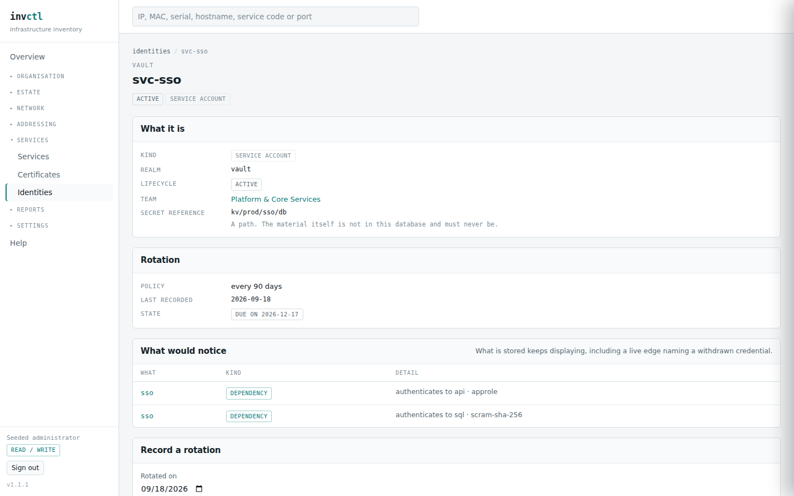

# Services, certificates and credentials

> Covers: `/services`, `/certificates`, `/identities`, `/identities/{id}`
> Regenerated when: the service model, certificate deployment or credential
> rotation changes.

Three pages that answer the same question from different ends: **what is
running, what proves it is who it says it is, and what it authenticates as.**
All three are declared — nothing here is discovered, and nothing here reaches
out to check.

## Services

A service is the **logical** thing — one row however many replicas run. That is
the whole reason the model separates a service from its instances: a dependency
is written once, against the service, rather than once per replica and then
maintained as replicas come and go.

**Availability is a declaration about what survives, not a count.** The column
says what the estate is supposed to do when an instance dies, and the impact
engine branches on it:

| | |
|---|---|
| `standalone` | one instance, and losing it loses the service |
| `active_active min N` | keeps serving while at least N instances remain |
| `active_passive` | a standby takes over, and the failover note says whether that is automatic or somebody's job at 03:00 |
| `quorum` | needs a majority, so losing two of three is not the same as losing one |

`pgsql-core` reads *"active_passive failover: manual"*. That is worth more than
it looks: the estate has a standby, and somebody still has to promote it. An
impact report that treated the failover as automatic would be quietly wrong
about how long the outage lasts.

**Tier is what the estate decided matters**, not what the software inferred. It
appears beside services in the expiry report and the impact pages so that "six
things expired" can be read as "and one of them is tier 1".

## Certificates

Sorted by expiry, soonest first, and that ordering is the page's argument: **a
certificate lapses every ninety days where hardware support lapses every five
years**, so this is usually the list that matters before any of the others.

Four columns carry the weight:

- **Covers** is the subject plus its SANs. `*.example.com +3 more` is one
  certificate doing four jobs, and renewing it late breaks all four at once.
- **Deployed** counts the places it is actually installed. A certificate with
  three deployments is three things that stop trusting each other, and the
  expiry report counts every one of them rather than the certificate once.
- **Issuer** separates a public CA from your own. An internal CA expiring is
  an internal outage; a public one expiring is an internal outage your
  customers see.
- **Renewed by** is a team, not a person. If it reads `unassigned`, nobody has
  said whose job it is — and `partners.example.com`, nine days out, is
  unassigned in the demo.

Nothing here watches a port and reports what it finds. A certificate is
recorded because somebody recorded it, and an expiry date passing changes this
page and nothing else.

## Identities

An identity is **what a service authenticates as** — a service account, an API
token, a machine account in a directory.

**The rotation column has four answers, and collapsing them would lose the
argument.** All four are visible above:

| | |
|---|---|
| **no policy** | nobody said this should be rotated. Not a finding — a machine account in a directory may legitimately never rotate |
| **never recorded** | there IS a policy and nobody has ever recorded doing it. The opposite fact from the row above, and the one that used to read the same |
| **due in 58 d** | a policy, a date, and time in hand |
| **overdue by 112 d** | a policy, a date, and the date has passed |

*"No policy"* and *"never recorded"* are opposite facts. One says the estate
decided this credential does not need rotating; the other says it decided it
does and then nobody did. A single boolean answers both with "not ok", which is
how a credential nobody manages and a credential everybody forgot end up in the
same bucket.

### The secret reference is a path, and only a path

`kv/prod/sso/db` is where the credential lives, not the credential. The page
says so under the value, and the rule is absolute: **if a code path would put
actual secret material in this database, that is a bug to raise rather than a
field to fill.**

The list page deliberately shows only *whether* a reference is recorded. The
value itself renders here, on the detail page, to an Administrator, one
credential at a time — and it is kept out of the audit trail and out of search
for the same reason. A list of where an estate keeps its credentials is a
reconnaissance map even when every value behind it is unreachable.

**"What would notice"** is the answer to *"can I retire this?"*. It names the
dependencies that authenticate with this identity — here, `sso` reaching an API
by approle and a database by SCRAM. Withdrawing a credential does not rewrite
them: what is stored keeps displaying, marked withdrawn, because re-pointing a
dependency is somebody's decision and attributing it to whoever clicked
*Withdraw* would be a lie in the change log.

### Recording a rotation

Recording a rotation is its own act with its own audit entry — deliberately not
folded into correcting the credential. Declaring that a credential exists and
recording that somebody rotated it are two different statements, and burying
the second inside an edit is how the rotation history stops being findable.

The state recomputes from the policy: `2026-09-18` plus ninety days gives
**due on 2026-12-17**, and the overdue banner goes. Nothing is stored for the
state itself — it is derived on every read, so it cannot drift from the date
beside it.

**A date in the future is refused.** So is one that does not parse. Both would
otherwise read as the healthiest state there is, which is the wrong direction
to be wrong in for a credential.
